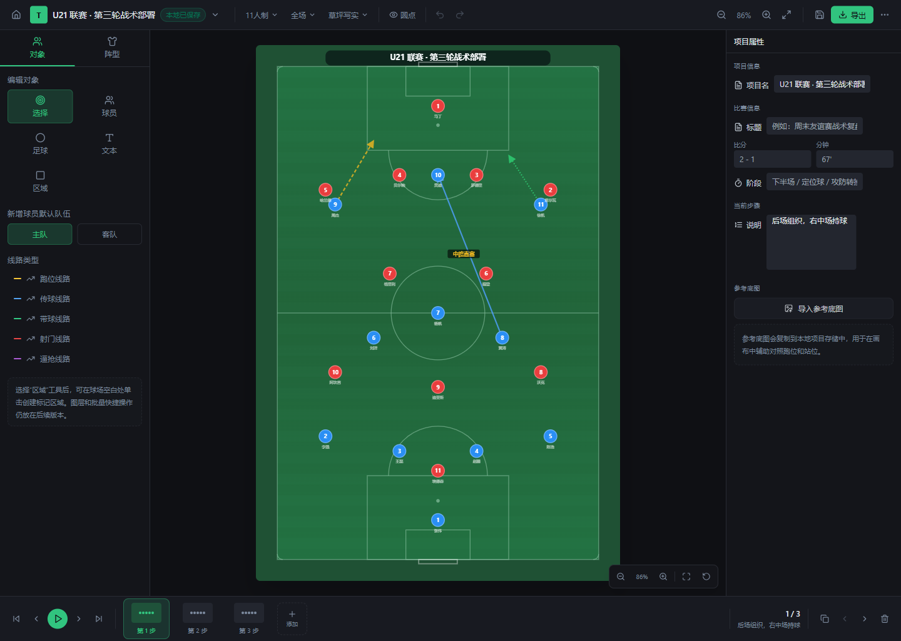
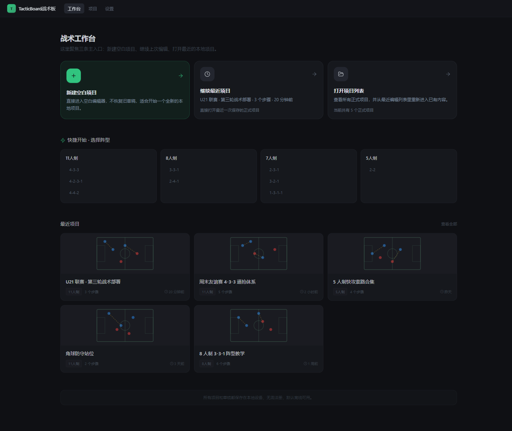
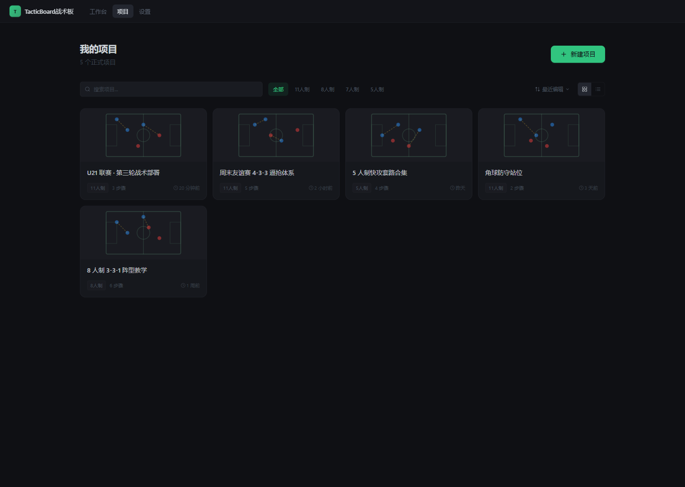
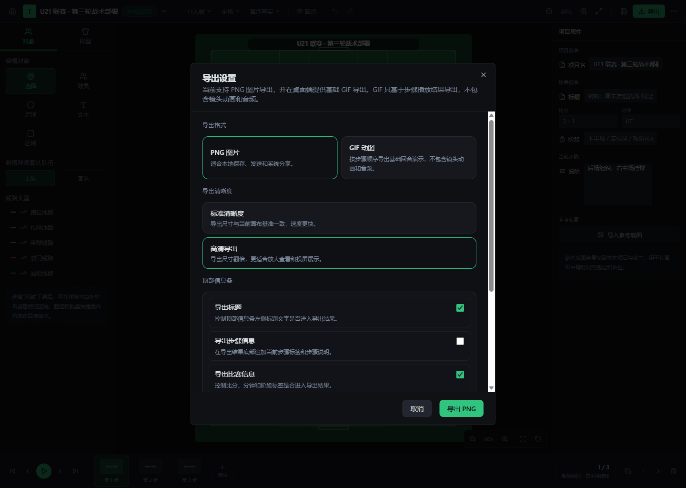

# TacticBoard 战术板

> 一款面向业余足球、战术讲解与赛后复盘的本地优先战术板应用。<br>
> 打开即用，离线可创作，围绕 `新建 -> 编辑 -> 保存 -> 导出` 构建完整闭环。

[](https://github.com/KevinRunzhi/TacticBoard/releases/latest)
[](https://github.com/KevinRunzhi/TacticBoard)
[](https://github.com/KevinRunzhi/TacticBoard)

## 核心能力

- 本地优先：无需注册账号，项目、草稿、设置都保存在本地设备
- 足球专用：球员、足球、文本、线路、区域、参考底图都围绕战术表达设计
- 多步骤讲解：支持步骤新增、复制、删除、重排与播放
- 导出闭环：支持 PNG 导出；Windows 端支持 GIF 导出；Android 端支持系统分享
- 持续创作：支持最近项目、继续编辑、自动保存与恢复
- 跨端一致：共享同一套前端业务代码，通过平台桥接适配 Windows 与 Android

## 适合什么场景

- 队内讨论阵型、站位和跑位
- 做训练前的快速讲解图
- 复盘某个关键回合或战术变化
- 输出适合发群、投屏或做讲解材料的战术图

## 产品预览

### 战术编辑器



### 工作台



### 项目管理



### 导出设置



## 安装与使用

### Windows

1. 打开 [GitHub Releases](https://github.com/KevinRunzhi/TacticBoard/releases/latest)
2. 下载 `TacticBoard-windows-x64-installer.exe`
3. 双击安装，完成后从开始菜单或桌面启动 `TacticBoard战术板`

说明：

- 当前公开 release 为 `Windows x64`
- 当前未做代码签名时，Windows SmartScreen 可能提示安全确认，这属于当前阶段的预期现象

### Android

1. 打开 [GitHub Releases](https://github.com/KevinRunzhi/TacticBoard/releases/latest)
2. 下载 `TacticBoard-android.apk`
3. 在 Android 设备上完成安装并启动 `TacticBoard`

说明：

- 当前公开 Release 已提供 Android 安装包（APK）
- 当前 Android 安装与下载入口以 GitHub Releases 页面为准

## 当前公开发布状态

| 平台 | 当前状态 | 说明 |
| --- | --- | --- |
| Windows | 已公开发布 | 最新公开版本为 [`v0.1.0`](https://github.com/KevinRunzhi/TacticBoard/releases/latest)，提供 `Windows x64` NSIS 安装包 |
| Android | 已公开发布 | 最新公开版本为 [`v0.1.0`](https://github.com/KevinRunzhi/TacticBoard/releases/latest)，提供 Android 安装包（APK） `TacticBoard-android.apk` |

如果你关心 Android 当前到底到了哪一步，直接看：

- [Android Release Distribution Status](docs/android-packaging/android-release-distribution-status.md)
- [Android Phase 1 Real-Device Validation Status](docs/android-packaging/android-phase1-realdevice-validation-status.md)

## 当前版本已经覆盖的主链路

- 工作台、项目页、设置页、编辑器主壳层
- 本地项目保存、草稿恢复、最近项目继续编辑
- 球员、足球、文本、线路、区域、参考底图等核心对象编辑
- 多步骤新增、复制、删除、重排与播放
- PNG 导出
- Windows GIF 导出
- Android 系统分享
- Windows 安装包构建
- Android 安装包（APK）构建与验收基线

## 当前明确不做的事

当前版本聚焦的是 `本地单机战术编辑体验`，暂不包含：

- 注册 / 登录 / 账号系统
- 云同步
- 在线分享页或分享链接
- 团队协作
- 自动更新
- 应用商店首发

## 开发者入口

如果你想从源码运行：

```bash
cd tactics-canvas-24
npm install
npm run dev
```

常用命令：

```bash
npm run build
npm run test
npm run lint
npm run tauri:dev
npm run tauri:build
```

## 仓库结构

```text
IDKN/
├─ docs/                 产品、工程、验收、打包与验证基线
├─ tactics-canvas-24/    React + Vite + Tauri 应用代码
└─ README.md             仓库首页与发布说明入口
```

## 文档入口

- [PRD](docs/football-tactics-board-prd.md)
- [Requirements](docs/football-tactics-board-requirements.md)
- [Information Architecture](docs/football-tactics-board-information-architecture.md)
- [Docs Review Index](docs/DocsReview/README.md)
- [Android Packaging Docs](docs/android-packaging/README.md)
