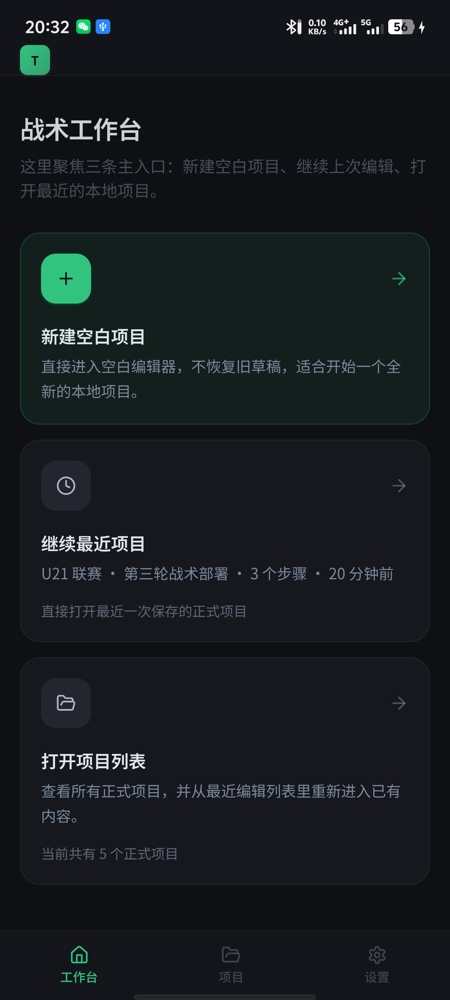
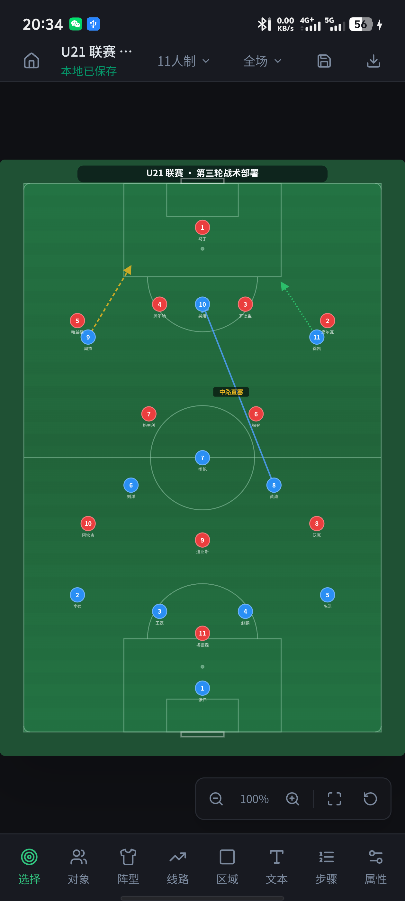
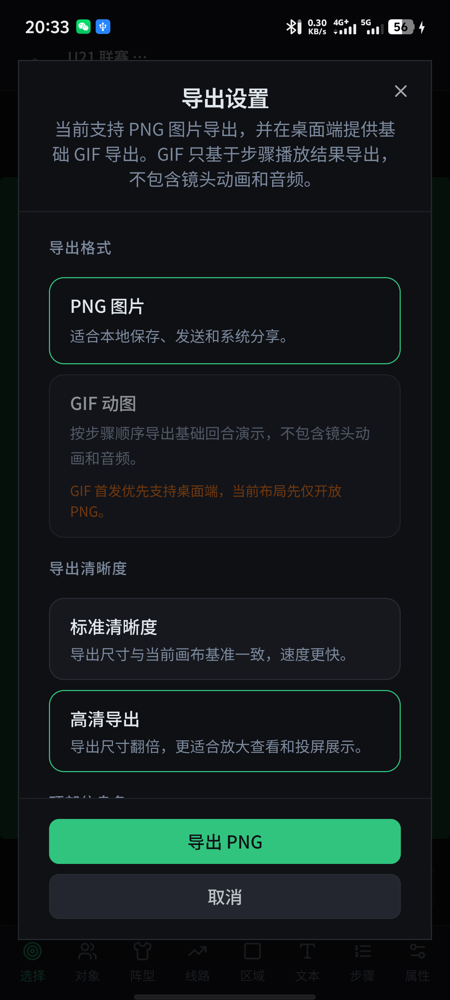
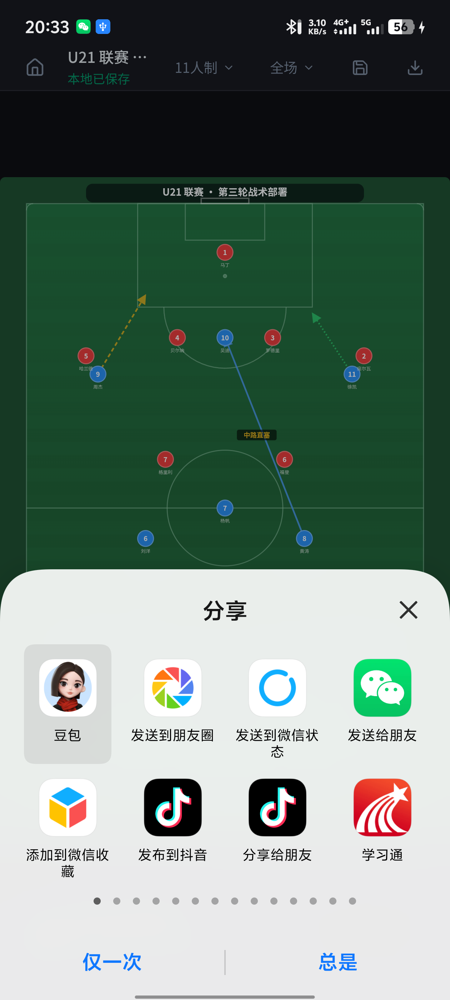

# TacticBoard 战术板

> 一个面向业余足球爱好者、教练和战术讲解场景的 **本地优先战术板应用**。<br>
> 无需注册、无需联网，支持项目保存、步骤演示、PNG / GIF 导出、Android 系统分享与参考底图导入。

[](https://github.com/KevinRunzhi/TacticBoard/releases)
[](https://github.com/KevinRunzhi/TacticBoard/releases)
[](https://github.com/KevinRunzhi/TacticBoard/releases)

## 立即下载

- **Windows 安装包**：[`TacticBoard-windows-x64-installer.exe`](https://github.com/KevinRunzhi/TacticBoard/releases/latest/download/TacticBoard-windows-x64-installer.exe)
- **Android APK**：[`TacticBoard-android.apk`](https://github.com/KevinRunzhi/TacticBoard/releases/latest/download/TacticBoard-android.apk)
- **校验文件**：[`SHA256SUMS.txt`](https://github.com/KevinRunzhi/TacticBoard/releases/latest/download/SHA256SUMS.txt)
- **所有版本 / Release 页面**：https://github.com/KevinRunzhi/TacticBoard/releases

当前公开发布形式：

- Windows `x64` NSIS 安装包 `.exe`
- Android 通用安装包 `.apk`
- Windows 安装完成后可直接从开始菜单或桌面启动
- Android 下载 APK 后可直接在设备上安装
- 当前 Windows 未做代码签名时，SmartScreen 可能提示安全确认，这属于当前阶段的预期现象

## 它适合做什么

TacticBoard 不是一个依赖账号、云端和后台的复杂平台，而是一个可以 **直接打开、直接画、直接保存、直接导出** 的本地足球战术工具。

你可以用它来：

- 设计训练课里的阵型和跑位
- 演示比赛中的攻防转换和定位球套路
- 保存多个战术项目，之后继续编辑
- 导出 PNG 图片发到群里或做讲解资料
- 导出 GIF 动图做简单步骤演示
- 在 Android 上通过系统分享面板把战术图发出去
- 导入参考底图，在真实站位图上继续标注

## 核心功能

- **本地优先**：项目、草稿和设置都保存在本地设备，无需注册登录
- **多项目管理**：工作台、项目列表、最近项目、继续编辑链路已经打通
- **战术编辑器**：支持球员、足球、文本、线路、区域等核心对象编辑
- **步骤编排**：支持新增、复制、删除、重排和播放步骤
- **导出分享**：支持 PNG 导出、Windows GIF 导出和 Android 系统分享
- **参考底图导入**：可把参考图片作为战术讲解底板使用
- **跨端交付**：当前已经支持 Windows 安装包和 Android APK 公开发布

## 产品截图

### 桌面端


### Android 手机端

<table>
  <tr>
    <td align="center"><br>工作台</td>
    <td align="center"><br>编辑器</td>
    <td align="center"><br>导出设置</td>
    <td align="center"><br>系统分享</td>
  </tr>
</table>

### 项目管理与导出闭环

桌面端适合大屏编辑和 GIF 导出，Android 端适合随手打开项目、导出 PNG 并通过系统分享发送给队友。

## Windows 安装说明

1. 打开 [Releases 页面](https://github.com/KevinRunzhi/TacticBoard/releases)
2. 下载 `TacticBoard-windows-x64-installer.exe`
3. 双击安装，完成后直接启动 `TacticBoard战术板`

如果 Windows 弹出 SmartScreen：

- 点击“更多信息”
- 再点击“仍要运行”

这不是打包失败，而是未签名桌面应用在当前阶段的常见提示。

## Android 安装说明

1. 打开 [Releases 页面](https://github.com/KevinRunzhi/TacticBoard/releases)
2. 下载 `TacticBoard-android.apk`
3. 在 Android 设备上允许安装来自浏览器或文件管理器的 APK
4. 完成安装后启动 `TacticBoard`

Android 当前已经覆盖：

- APK 安装与冷启动
- 工作台、项目页、编辑器、设置页主链路
- PNG 导出与系统分享
- 参考底图导入
- 后台恢复与横竖屏恢复

## 当前版本已经支持的能力

- 工作台、项目页、设置页、编辑器壳层
- 本地草稿保存、正式保存、最近项目、继续编辑
- 球员、足球、文本、线路、区域等核心对象编辑
- 步骤新增、复制、删除、重排、播放
- 比赛信息与参考底图
- PNG 导出与 GIF 导出
- Android 系统分享
- Windows 桌面壳与安装包构建链路
- Android APK 构建、签名、安装与验收链路

## 当前已知范围

当前版本聚焦的是 **本地单机战术编辑体验**，暂不包含：

- 注册 / 登录 / 账号系统
- 云同步
- 在线分享页
- 团队协作
- 自动更新
- Windows 代码签名

## 开发者入口

如果你想自己运行源码或继续开发：

```bash
cd tactics-canvas-24
npm install
npm run dev
```

常用命令：

```bash
npm run build
npm run test
npm run lint
npm run tauri
npm run tauri:dev
npm run tauri:build
npm run tauri:android:init
npm run tauri:android:dev
npm run tauri:android:build
```

## 仓库结构

```text
IDKN/
├─ docs/                 产品文档、工程文档、评审记录、验收标准
├─ tactics-canvas-24/    React + Vite + Tauri 应用代码
└─ README.md             仓库首页与下载入口
```

## 文档入口

如果你更关心产品定义、工程设计和验收过程，可以从这里继续看：

- `docs/football-tactics-board-prd.md`
- `docs/football-tactics-board-requirements.md`
- `docs/football-tactics-board-information-architecture.md`
- `docs/android-packaging/android-release-distribution-status.md`
- `docs/DocsReview/`
