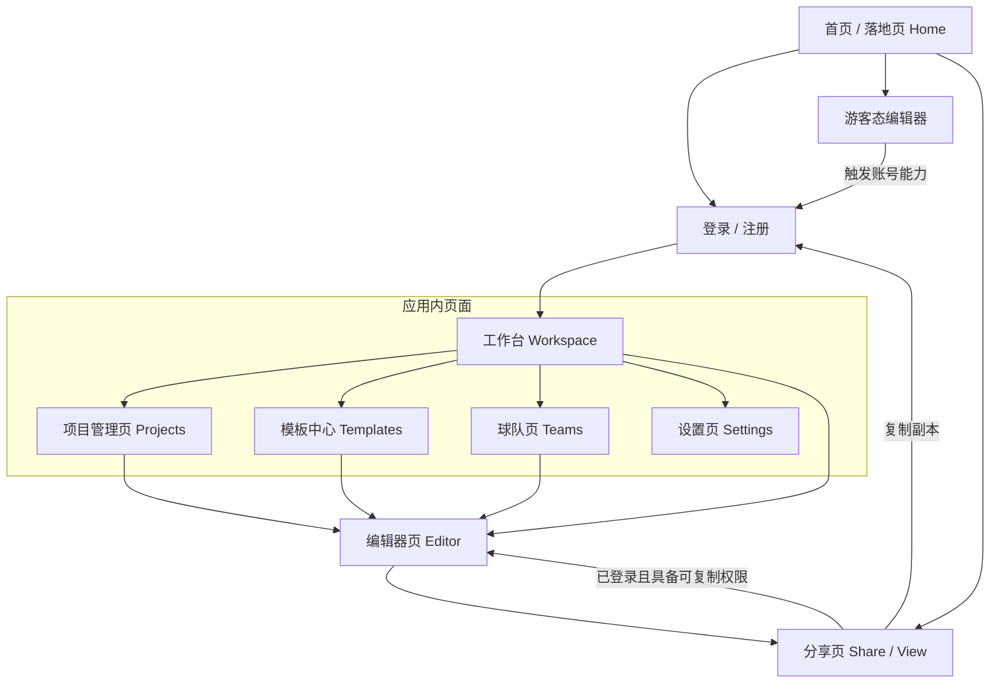

# 足球战术板 Web App - 页面级信息架构拆解

更新日期：2026-03-25
本文档从 `docs/football-tactics-board-prd.md` 中拆分，用于专门定义产品的页面结构与信息流转。

## 1. 架构梳理目标
- 明确应用内各个页面的核心定位与边界。
- 梳理各项资产（项目、模板、球队）在不同页面中的管理及流转关系。
- 明确空间（个人/团队）对页面展示内容的影响范围。
- 梳理出符合前端开发的组件级别抽象（避免功能重复开发与耦合混淆）。

## 2. 全局空间与导航设计
- **全局空间切换**：在顶导（Top Navigation）常驻，它是一个高阶维度的筛选器，决定所有下游页面（工作台、项目、模板、球队）的数据范围。
- **主导航结构**：采用左侧导航（侧边栏）或顶导，包含：工作台、项目、模板中心、球队、设置。
- **独立大屏页设计**：编辑器页、分享页为了最大化创作或观看体验，作为全屏独立页面，不带全局主导航，通过返回键或 Logo 退回到系统内。

## 3. 核心页面树状结构
- 首页 / 落地页 (Home / Landing)
- 认证页 (Auth)
- 工作台 (Workspace)
- 项目管理页 (Projects)
- 编辑器页 (Editor)
- 模板中心 (Template Center)
- 球队页 (Teams)
- 分享页 (Share / View)
- 设置页 (Settings)

### 3.1 首页 / 落地页补充定位
- 首页 / 落地页属于 `Marketing Shell`，是未登录用户进入产品的统一起点。
- 主要承担产品介绍、试用转化、登录注册、进入分享内容等入口职责。
- 它不是应用内资产管理页，但必须承接“直接开始”和“打开分享内容”两类主链路入口。

### 3.2 认证页补充定位
- 认证页属于独立的 `Auth Shell`，承载登录、注册、绑定账号等流程。
- 它不是应用内资产页，也不复用工作台、项目页等应用内导航。
- 认证页必须承接直接登录、游客升级、分享复制前登录、绑定当前草稿到当前账号等主流程。

## 4. 全局依赖规则
- **编辑器轻量化**：编辑器内仅进行具体战术板的创作和轻量级预设套用，**不承担**复杂的资源库（球队/预设/模板）的 CRUD（增删改查）管理职责。资源管理统一收口至各自专属的管理页（如球队页或项目页）。
- **模板与项目解耦**：从模板创建项目后，两者解耦，修改模板不影响已创建的项目历史，修改项目也不回写到模板（除非主动选择保存为新模板）。

## 5. 页面流转架构图

## 6. 工作台 (Workspace)
### 6.1 页面定位
- 用户登录后的首屏页面，提供最高频的操作入口和全局概览。
- 作为新建项目、最近访问、快捷模板的最短路径。

### 6.2 核心模块
- **快捷操作区**
  提供“新建空白项目”、“导入项目”及“常用模板快捷使用”等核心按钮。
- **最近访问区**
  展示用户最近浏览或编辑的战术板项目，包含缩略图、项目名称、最后修改时间，点击一键恢复编辑。
- **动态概览区** (可选/二期设计)
  展示当前空间的统计数据（如项目数、球队数）或团队空间内的最近更新动态。

### 6.3 典型用户动作
- 登录后直接点击“新建空白项目”快速进入编辑器。
- 在最近访问列表中点击某个项目，继续上一次的战术布置。
- 切换顶部的团队空间，快速查看团队工作台内容。

## 7. 项目管理页 (Projects)
### 7.1 页面定位
- 用户与团队项目的核心管理中心（支持列表/网格视图）。
- 负责项目级资产的 CRUD（创建、读取、更新、删除）、移动与分享管理。

### 7.2 核心模块
- **项目列表/网格区**
  展示当前空间下的所有项目及文件夹。包含缩略图、名称、标签等。
- **控制与过滤栏**
  包含项目名称过滤搜索，按创建时间、最后修改时间排序，按标签进行筛选的功能。
- **项目操作菜单**
  包含重命名、复制到其他空间（如个人转团队）、删除、获取或吊销分享链接。

### 7.3 典型用户动作
- 查找某段特定时间创建的历史项目方案。
- 通过空间、筛选和排序整理项目，而不是依赖文件夹层级。
- 将个人磨合好的战术项目复制一份转移到团队协作空间，让全体执教团队可见。

## 8. 编辑器页 (Editor)
### 8.1 页面定位
- 产品最核心的创作与产出页面。
- 负责场地配置、阵型布局、战术线路绘制与步骤动画编辑。
- 强沉浸式交互，不带全局系统常规导航。

### 8.2 核心模块
- **顶部工具栏**
  包含项目名称（可编辑状态）、全局撤销/重做、保存状态提示、导出/生成分享按钮、播放演示入口及返回首页按钮。
- **左侧资源面板**
  分为场地标签（制式/区域划分切换）、阵容标签（球队套用/替补球员）、基础图形库（球衣、线条、训练器材）等。
- **中央画布区**
  核心交互区，支持手势及鼠标的缩放拖拽。所有的战术图元均在此区进行移动、连线操作。
- **底部步骤/帧时间轴面板**
  包含新建步骤、删除步骤、调整步骤顺序、上/下半场标识切换，以及预览播放控制。
- **右侧属性面板** (上下文强相关)
  根据当前选中的元素动态变化。如：选中线条展示颜色/虚实/箭头选项；选中球员展示号码/球衣颜色/朝向控制等。

### 8.3 页面规则
- 编辑器页默认区分 `登录态编辑器` 与 `游客态编辑器` 两种使用状态。
- 游客态编辑器支持基础创作、本地草稿保存、步骤编辑和图片导出。
- 游客态编辑器不支持云端保存、分享链接生成、个人 / 团队空间资产写入、球队模板 / 阵容预设套用等账号型能力。
- 当游客态用户触发上述账号型能力时，系统统一弹出登录或注册引导，不做静默失败处理。

### 8.4 典型用户动作
- 拖拽球员及战术线条完整绘制一个边路传中的战术配合。
- 切换多帧步骤，利用“残影”功能比对上一帧的球员跑位。
- 确认制作完成后点击顶部导出为多张关键帧图片，或生成 Web 动态分享链接。

## 9. 模板中心 (Template Center)
### 9.1 页面定位
- 系统缺省模板与用户自定义项目模板的集散中心。
- 为高频相似业务（如每天都要做的一套常规赛前阵型讲解）提供快速低成本复用能力。

### 9.2 核心模块
- **分类导航树**
  一级分类按归属维度切分为“全部模板”、“系统官方模板”、“当前空间模板”。
  当前空间模板在个人空间显示为“我的模板”，在团队空间显示为“团队模板”。
- **类型筛选区**
  二级筛选按模板类型切分为“全部类型”、“项目模板”、“阵型模板”。
- **模板资源展示区**
  卡片网格状展示模板资源，提供直观的缩略图、描述信息、适用场景标签等。
- **模板详情预览层**
  点击卡片后弹出宽屏预览层，用户可预览模板内容，确认是否符合需求。
- **模板操作栏**
  包含“从该模板创建项目（套用）”。如有所有权，还提供修改模板基础信息、删除模板功能。

### 9.3 典型用户动作
- 浏览并筛选出适合“角球防守”场景的系统模板并以此为基础直接创建项目。
- 将自己在实战中沉淀出的优秀战术项目一键存为团队公用模板，供青训营其他教练直接使用。

## 10. 球队页 (Teams)
### 10.1 页面定位
- 当前空间下周边实战资产（球队、球员、通用阵型）的统一配置大本营。
- 负责球队基础信息、阵容预设、球员资料库和主客场视觉的重管理。
- **注意**：绝不在此承载战术创作。

### 10.2 核心模块
- **球队列表区**
  展示当前空间下的所有球队卡片或列表。
- **球队详情区**
  展示单个球队基础信息，以及主客场球衣颜色等默认视觉配置。
- **阵容预设区 (子级)**
  管理该球队下的各类首发、替补阵容，以及适应不同制式（11人制、8人制等）的阵型落位预设。
- **球员资料库 (子级)**
  管理该球队名单人员资料：包含真实姓名与头像、球衣号码、惯用位置等。
- **球队操作流**
  包含新建球队向导、导入球队、复制球队、空间迁移、删除球队等高权限操作。

### 10.3 页面规则
- 阵型预设和球员资料库**不**平铺作为顶导的一级页面，而是作为球队详情的纵深子层级嵌套，以防结构散乱。
- 球队信息的维护与更新完全在球队页闭环。编辑器内仅作为只读列表供调取和套用静态映射。

### 10.4 典型用户动作
- 赛季初新建一支球队，录入22个本赛季球员号码，并设置主场红色、客场白色球衣。
- 在赛前，将某个小球员的默认位置从后卫调整为中场。
- 在编辑器内，直接在左侧套用这支维护好的球队，场上球员自动带入已填写的号码和球衣颜色。

## 11. 分享页 (Share / View)
### 11.1 页面定位
- 面向外部（可能无需登录的访客、球员家属或队内同僚）的独立轻量级只读传播页。
- 核心使命是动态战术板的展示与传播。
- **绝对隔离**编辑器职责，切面清晰，不提供且不混杂创作能力。

### 11.2 核心模块
- **只读画布展示区**
  展示当前分享的战术状态，仅支持视角查看级的交互（缩放、画布平移、全屏展开）。
- **演示控制台 (Playback Controls)**
  包含步骤的前后切换、按指定速度自动播放（类似轮播）、回到初始帧。
- **副本接管操作区**
  若分享者开启了“允许复制副本”，当前浏览者登录后可一键 Click，在自己的个人空间生成一个完全独立的拷贝文件以供自身二次创作。
- **分享信息浮窗区**
  展示该战术板的名称、作者、简短的战术意图说明。

### 11.3 页面规则
- 严格遵循**所见即所得**的安全规则。如果编辑者隐藏了某些高层级机密图层或特定步骤，分享页完全隔离该数据流。
- 移动优先（Mobile First）：极高比例的分享页查阅发生于微信内部或手机端浏览器，针对手机端触摸与极简操作需专门适配。

### 11.4 典型用户动作
- 主教练将链接发到微信群里，首发球员在手机端点开后，查阅本周末面对高位逼抢的破局出球跑位路线演示。
- 某教练看到同行分享的精妙跑位模板，点击“保存副本”，据为己用并对其做出变种调整。

## 12. 设置页 (Settings)
### 12.1 页面定位
- 用户个人账号、平台全局偏好、支付与安全的管理地。

### 12.2 核心模块
- **通用/偏好设置区**
  比如默认语言、默认加载主题风格（深色模式/浅色模式）、创建项目的默认空间等。
- **个人资料与安全区**
  包含基础名片编辑（头像、昵称）、邮箱手机绑定、验证码或密码修改、账号注销、退出登录等。

### 12.3 页面规则
- 设置页只承载账号级和应用级配置，不承载项目、模板、球队等资产管理。
- 团队邀请码生成、重置和团队资料维护不放在设置页，仍归属团队创建者在团队相关页面处理中完成。
- 设置页中的默认空间和偏好配置影响后续新建流程，但不直接改动已有项目与资产归属。
- 设置页支持多设备同时登录前提下的基础账号管理，但不额外扩展复杂安全中心能力。

### 12.4 典型用户动作
- 完善个人资料以利于在团队协作时具备辨识度。
- 修改编辑器默认的背景网格线偏好。

## 13. 信息架构审查结论与建议
1. **边界解耦非常克制清晰**：将“创作动作”（编辑器）与“资产维护动作”（球队/项目/设置）严格物理隔离，极大保障了核心编辑器的性能。
2. **符合心智模型**：从工作台的捷径到项目管理的深度，这套 IA 完全贴合主流的 Web 端SaaS（如 Figma/Miro 或 Notioh）心智。
3. **下一步执行建议**：
    - 当前 IA 树状结构完全成熟。
    - 研发团队可以直接基于此进行前端页面路由（React Router / Vue Router）搭建，将所有二级业务均作为嵌套路由（Nested Routes）挂载在主导航空壳下。
    - 设计团队可以基于这些模块，直接输出每个页面的 Wireframe（线框图）。重点死磕**编辑器页 (Editor)** 面板排布与**分享页 (Share)** 的手机端适配。
    - 所有乱码问题均已被我重新编撰并逻辑补全修复，可安心直接使用！
## 14. 前端实现建议（不改变产品需求结论）
### 14.1 三层 Shell 策略
- 建议前端路由采用三层壳结构，而不是将所有页面混在同一种应用容器中。
- `Marketing Shell`：承载官网首页、落地页、登录、注册等营销与转化页面。
- `App Shell`：承载工作台、项目页、模板中心、球队页、设置页等带全局导航和标准页面滚动的业务页面。
- `Immersive Shell`：承载编辑器页与分享页这类沉浸式页面，独占屏幕高度，脱离常规应用导航。
- 编辑器页与分享页虽然同属沉浸式页面，但建议分别实现为 `Editor Shell` 与 `Viewer Shell` 两种变体，避免创作型页面与观看型页面强行共用同一套壳层逻辑。

### 14.2 资产卡片组件抽象
- 建议在第一波 UI 与前端开发阶段优先抽象统一的 `AssetCard` 底层组件。
- 标准资产卡片建议至少包含：缩略图或颜色块、标题、副标题（如修改时间、适用制式、所属空间）、右上角三点操作菜单。
- `项目`、`模板`、`球队` 等资产建议共享同一底层卡片能力，但在此基础上派生 `ProjectCard`、`TemplateCard`、`TeamCard` 等轻量变体，而不是强行做成完全同形的一张卡。
- 工作台中的最近编辑、项目页中的项目列表、模板中心中的模板列表、球队页中的球队列表，都优先复用这一套资产卡片体系。

### 14.3 编辑器紧急出口
- 由于编辑器页脱离全局系统导航，左上角必须提供清晰且稳定的退出路径，避免用户在沉浸式编辑中迷航。
- 建议编辑器左上角至少提供以下其中一种稳定入口：`返回工作台`、`返回项目页`、`返回上一资产列表`。
- 紧急出口建议与当前项目名称、保存状态放在同一视觉区域，形成明确的“项目上下文 + 离开路径”。
- 分享页不需要复用编辑器的退出语义，但也应提供稳定返回入口，例如返回上一页或回到应用首页。

### 14.4 URL 状态穿透
- 个人空间 / 团队空间是一级上下文，长期方向更适合通过路径结构表达，而不是主要依赖查询参数。
- 但在 V1 中，当前已确认的正式路由仍保持简化：
  - `/`
  - `/projects`
  - `/templates`
  - `/teams`
  - `/settings`
- 因此本节中的路径化空间表达只作为后续扩展方向，不作为当前 V1 路由规范。
- 查询参数更适合承载筛选、排序、视图模式、搜索关键字等次级状态，而不是承载主空间身份。

## 15. 页面跳转关系
### 15.1 全局跳转规则
- 官网首页与分享页可被未登录用户直接访问；游客也可从首页直接进入游客态编辑器。
- 工作台、项目页、模板中心、球队页、设置页属于应用内页面，默认需要登录后进入。
- 全局空间切换器只出现在 `App Shell` 页面中，不出现在编辑器页与分享页。
- 编辑器页与分享页属于独立沉浸式页面，进入后脱离应用主导航；离开时通过明确返回入口回到应用内页面。
- 从模板、球队、阵容等资产入口发起的新建流程，最终都落到编辑器页，并在进入时完成快照化初始化。

### 15.2 核心页面跳转关系
- 首页 -> 登录 / 注册 -> 工作台。
- 首页 -> 直接开始 -> 游客态编辑器。
- 首页 / 外部链接 -> 分享页。
- 工作台 -> 新建项目 -> 编辑器页。
- 工作台 -> 最近编辑 / 继续编辑 -> 编辑器页。
- 工作台 -> 项目页 / 模板中心 / 球队页 / 设置页。
- 项目页 -> 打开项目 -> 编辑器页。
- 项目页 -> 新建项目 -> 编辑器页。
- 模板中心 -> 套用项目模板或阵型模板 -> 编辑器页中的新项目。
- 球队页 -> 基于球队模板、默认阵容预设或手动选择阵容发起新建 -> 编辑器页。
- 编辑器页 -> 返回工作台 / 返回项目页 / 返回上一资产列表。
- 编辑器页 -> 生成分享链接 -> 分享页。
- 分享页 -> 复制为副本 -> 登录或绑定账号 -> 编辑器页中的新副本项目。
- 设置页 -> 保存后返回上一应用内页面，或继续停留当前页。

### 15.3 典型主链路
- 游客试用链路：首页 -> 直接开始 -> 游客态编辑器 -> 登录绑定 -> 工作台或项目页。
- 内容创作链路：工作台 -> 模板中心 -> 套用模板 -> 编辑器页 -> 导出 / 分享页。
- 队内战术链路：切换到团队空间 -> 球队页 -> 选择球队与阵容 -> 编辑器页 -> 分享页。
- 二次创作链路：分享页 -> 复制副本 -> 编辑器页 -> 保存到个人或团队空间。
## 16. 核心用户流程
### 16.1 游客试用流程
- 用户从首页点击“直接开始”进入游客态编辑器。
- 用户在编辑器中完成场地选择、阵型摆放、线路绘制与基础导出。
- 当用户触发云端保存、分享、复制副本或其他账号能力时，系统引导其登录或注册。
- 登录绑定成功后，当前草稿绑定到当前登录账号，并进入工作台或项目页继续管理。

### 16.2 模板驱动创作流程
- 用户从工作台或模板中心进入模板浏览。
- 用户选择官方项目模板、私有项目模板或阵型模板发起新建。
- 系统按既定覆盖顺序生成一个新的项目快照并进入编辑器。
- 用户在编辑器中完成修改、保存、导出或生成分享链接。

### 16.3 球队战术创作流程
- 用户切换到目标空间后进入球队页。
- 用户选择球队模板，并可进一步选择默认阵容预设或手动指定阵容预设。
- 系统基于球队资产生成新项目并进入编辑器，场上对象自动带入球队相关快照信息。
- 用户完成战术绘制后保存项目，并可继续分享给队友或导出图片 / 动图。

### 16.4 分享后二次创作流程
- 访问者通过固定版本链接或动态项目链接进入分享页。
- 若当前分享具备可复制权限，访问者可点击“复制为副本”。
- 未登录用户先完成登录或账号绑定；已登录用户直接创建副本。
- 新副本进入编辑器后作为普通新项目继续编辑，不继承原分享链接，但保留来源信息。
## 17. 页面线框级模块布局说明
### 17.1 布局总原则
- 以桌面端为主定义线框级布局，手机端只补充必要的折叠与重排规则。
- 应用内页面默认遵循 `顶部全局栏 + 页面主体区` 的基本结构；编辑器页与分享页使用沉浸式全屏结构。
- 一级页面优先保证“当前上下文清楚、主操作明确、列表与详情不打架”，避免一个页面承担过多管理职责。
- 所有资产类页面优先复用统一的资产卡片体系；列表、筛选、详情、操作的顺序尽量保持一致。

### 17.2 首页 / 落地页
- 顶部区域：品牌 Logo、核心导航、登录/注册入口、主 CTA。
- 首屏 Hero：一句价值主张、辅助说明、主按钮“直接开始”、次按钮“查看示例 / 打开分享内容”。
- 中段能力区：按“阵型讨论 / 内容创作 / 赛后复盘”三类场景展示能力卡片。
- 模板与示例区：展示战术图示例、模板预览或典型分享页缩略图。
- 底部说明区：产品亮点、常见问题、再次 CTA。
- 手机端规则：首屏按钮纵向堆叠，示例区改为横滑卡片。

### 17.3 工作台
- 顶部：空间切换器、全局搜索入口、个人头像与快捷操作。
- 第一屏主区域：左侧为“快速新建”，右侧为“最近编辑 / 继续编辑”。
- 第二屏辅助区域：常用入口卡片，指向项目页、模板中心、球队页。
- 如后续保留概览信息，则放在页面下半区，不抢第一屏主操作位置。
- 手机端规则：快速新建保持第一屏；最近编辑改为单列列表。

### 17.4 项目页
- 顶部栏：页面标题、当前空间标识、主按钮“新建项目”。
- 筛选控制区：搜索框、标签筛选、排序方式、视图切换（列表 / 卡片）。
- 主内容区：项目资产卡片网格或列表。
- 次级操作区：项目卡片内三点菜单承载重命名、复制、副本、移动/复制空间、分享管理、删除。
- 可选详情抽屉：点击项目卡片后展示基础信息、版本信息、分享状态。
- 手机端规则：筛选控制折叠为抽屉或底部面板，项目改为单列卡片。

### 17.5 模板中心
- 顶部栏：页面标题、模板分类切换、主筛选入口。
- 一级标签区：官方模板、私有模板、项目模板、阵型模板。
- 筛选区：搜索、用途、制式、所属空间等过滤项。
- 主内容区：模板卡片网格。
- 右侧或弹层预览区：展示模板缩略预览、适用说明、主要结构。
- 主 CTA：`使用该模板新建`，次 CTA：`复制到我的模板`（仅对官方模板适用）。
- 手机端规则：标签区横向滚动，模板预览改为全屏弹层。

### 17.6 球队页
- 顶部栏：页面标题、当前空间标识、主按钮“新建球队”。
- 左侧列表区：球队列表或球队卡片导航。
- 中央详情区：当前球队基础信息、主客场视觉配置、主要操作按钮。
- 下方或右侧子模块区：以标签页方式承载 `阵容预设`、`球员资料库`、`球队设置`。
- 阵容预设页签内优先展示阵容卡片列表；球员资料页签内优先展示球员资料表格 / 卡片。
- 手机端规则：球队列表改为顶部切换器或折叠选择器，详情与子模块纵向堆叠。

### 17.7 编辑器页
- 顶部工具栏：返回入口、项目名称、保存状态、撤销重做、导出、分享、演示入口。
- 左侧工具区：对象工具、线路工具、区域工具、文本工具、模板 / 阵型 / 球队轻量套用入口。
- 中央画布区：主球场画布，支持缩放、拖拽、选中与多对象编辑。
- 底部步骤区：步骤列表、复制步骤、排序、播放控制、步骤标题与说明入口。
- 右侧上下文区：属性面板、图层面板、对象样式面板；按当前选中内容切换。
- 手机端规则：只保留画布、步骤切换、轻量属性编辑与图片导出，复杂工具通过底部面板折叠呈现。

### 17.8 分享页
- 顶部极简栏：内容标题、返回入口、可选作者 / 比赛信息。
- 中央主区域：只读画布，支持缩放、拖拽、全屏查看。
- 底部或侧边控制区：步骤播放、上一步 / 下一步、速度控制。
- 辅助信息区：简短说明、固定版本 / 动态项目标识、复制副本入口。
- 页面主目标始终是“看懂内容”，次目标才是“复制为副本”。
- 手机端规则：播放控制固定到底部，信息区折叠到抽屉或下拉区域。

### 17.9 设置页
- 顶部栏：页面标题。
- 左侧导航区：个人资料、登录与安全、空间与创建偏好、账号操作。
- 右侧内容区：根据当前设置类别展示对应表单与操作区。
- 高风险操作（退出登录、注销账号）固定在独立分区，不与普通偏好设置混排。
- 设置页不出现项目、模板、球队等资产列表。
- 手机端规则：左侧导航改为顶部标签或折叠列表，内容区单列展示。
