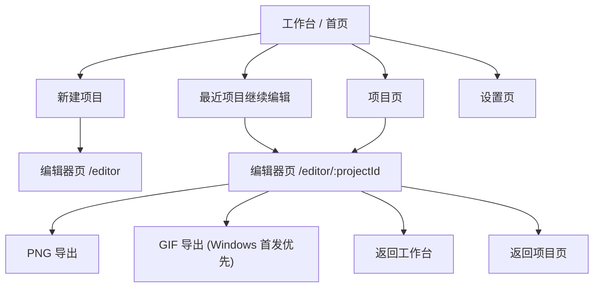
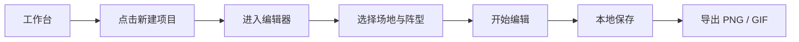

# 足球战术板信息架构

最后更新：2026-03-30
状态：V1 基线
关联文档：
- `docs/football-tactics-board-prd.md`
- `docs/football-tactics-board-requirements.md`

## 1. 文档目的

这份文档用于定义当前版本的页面结构、导航边界、主要页面职责和关键流转关系。

它服务于当前已冻结的产品方向：

- `Windows + Android` 首发
- `离线单机`
- `免注册`
- `业余足球爱好者优先`
- 优先完成 `新建 -> 编辑 -> 保存 -> 导出` 的核心创作闭环

本文档只描述第一阶段有效的信息架构，不延续旧版 Web 平台时期的账号、团队、分享页、模板中心等结构。

## 2. 当前信息架构原则

- 页面结构优先服务本地创作主链路，而不是平台化管理需求
- 第一阶段页面数量保持精简，避免过多独立页面分散心智
- 编辑器保持沉浸式，非编辑页面保持轻量应用壳层
- Windows 与 Android 共用同一套页面概念，但允许在交互层面分化
- 不引入登录、注册、绑定账号、在线分享页、团队空间等页面
- 不单独提供模板库、球队页、分享页等超出 V1 边界的导航入口

## 3. 当前页面总览

第一阶段仅保留以下页面层级：

- 工作台 / 首页
- 项目页
- 编辑器页
- 设置页
- 404 页面

对应推荐路由：

- `/`
- `/projects`
- `/editor`
- `/editor/:projectId`
- `/settings`
- `*`

第一阶段不保留的旧页面类型：

- 登录页
- 注册页
- 绑定账号页
- 在线分享页
- 球队页
- 独立模板页
- 营销落地页

## 4. 壳层设计

### 4.1 App Shell

适用页面：

- `/`
- `/projects`
- `/settings`

定位：

- 承载应用内的非沉浸式页面
- 提供稳定导航、返回路径和页面切换关系
- 强调“本地创作工具”而不是“在线平台”

建议包含：

- 顶部导航或顶部标题栏
- 主导航入口
- 当前页面标题
- 新建项目主按钮
- 可选的最近项目快捷入口

不应包含：

- 登录 / 注册入口
- 团队空间切换
- 在线分享中心
- 需要联网的状态栏

### 4.2 Editor Shell

适用页面：

- `/editor`
- `/editor/:projectId`

定位：

- 沉浸式创作页面
- 最大化球场画布和编辑效率
- 与普通页面导航解耦

建议包含：

- 顶部工具栏
- 画布主区域
- 工具面板 / 属性面板 / 步骤栏
- 返回工作台或项目页的稳定入口

不应包含：

- 全局营销内容
- 账号入口
- 在线分享入口
- 与当前编辑无关的管理型导航

## 5. 页面树状结构

## 6. 页面定义

### 6.1 工作台 / 首页

定位：

- 应用启动后的默认进入页
- 第一阶段最高频的入口页
- 承担“开始创作”和“继续创作”两类主路径

核心模块：

- 新建项目主入口
- 继续上次编辑
- 最近项目列表
- 内置阵型快捷开始
- 本地草稿恢复提示
- 本地应用说明或版本提示

不承担：

- 营销落地页职责
- 账号转化职责
- 团队动态与协作概览
- 大而全的资产管理

典型动作：

- 新建空白项目进入编辑器
- 从最近项目继续编辑
- 从阵型快捷入口开始摆盘
- 恢复异常退出前的自动保存草稿

### 6.2 项目页

定位：

- 本地项目的集中管理页
- 对“最近项目”之外的项目进行基础整理

核心模块：

- 项目列表
- 最近编辑时间排序
- 项目重命名
- 项目复制
- 项目删除

规则：

- 第一阶段不做标签体系、收藏体系、复杂筛选
- 第一阶段不做团队空间、共享空间、协作状态
- 项目复制作为第一阶段轻量版本管理补充
- 删除动作必须明确二次确认

典型动作：

- 打开某个项目继续编辑
- 复制某个项目做战术变体
- 删除无效项目

### 6.3 编辑器页

定位：

- 产品的核心创作页面
- 承担场地、阵型、对象、线路、步骤和导出的完整闭环

桌面端核心区域：

- 顶部工具栏
- 左侧工具区
- 中央球场画布
- 右侧属性区
- 底部步骤栏

移动端核心区域：

- 顶部轻量工具栏
- 球场主画布
- 底部工具栏
- 步骤抽屉
- 属性抽屉

编辑器必须承接的能力：

- 新建项目
- 打开本地项目
- 场地与阵型选择
- 核心对象编辑
- 步骤创建与切换
- 本地保存
- PNG 导出
- Windows 首发优先的 GIF 导出

编辑器不承接：

- 登录引导
- 分享链接生成
- 团队成员管理
- 独立模板库管理
- 完整资产库管理

### 6.4 设置页

定位：

- 本地应用偏好的集中设置页
- 不做账号中心，不做平台配置中心

建议模块：

- 导出偏好
- 画布与显示偏好
- 本地数据说明
- 版本信息
- 关于应用

不应包含：

- 账号资料
- 密码与验证码
- 团队管理
- 订阅或支付

### 6.5 404 页面

定位：

- 承接错误路由或失效路径
- 提供稳定返回路径

建议动作：

- 返回工作台
- 前往项目页

## 7. 导航规则

### 7.1 主导航规则

- 第一阶段主导航只保留：工作台、项目、设置
- 编辑器不放在常驻主导航中，而通过显式入口进入
- 新建项目按钮应在工作台和项目页都可快速触达

### 7.2 返回规则

- 从工作台进入编辑器，新建项目后可返回工作台
- 从项目页进入编辑器，编辑完成后可返回项目页
- 非法项目路径进入编辑器时，应给出返回工作台和查看项目两个出口

### 7.3 空状态规则

- 没有最近项目时，工作台优先引导新建项目
- 项目页为空时，优先引导新建第一个项目
- 最近项目记录失效时，允许用户移除无效条目而不是阻塞进入

## 8. 关键用户流

### 8.1 新建项目流

### 8.2 最近项目续编流

### 8.3 项目复制流

### 8.4 移动端快速导出流

## 9. 平台差异策略

### 9.1 Windows

- 优先承载长时间编辑体验
- 适合三栏或多面板布局
- 第一阶段优先支持 GIF 导出

### 9.2 Android

- 优先承载触控友好的完整编辑闭环
- 面板能力通过抽屉、底栏和浮层承接
- 第一阶段优先保证 PNG 导出和系统分享稳定
- 第一阶段不强制支持 GIF 导出

### 9.3 平板

- 按 Android 交互策略扩展
- 允许比手机更宽的布局，但不单独定义独立页面体系

## 10. 页面与功能映射

| 页面 | 第一阶段承载 | 第一阶段不承载 |
|---|---|---|
| 工作台 | 新建项目、最近项目、恢复草稿、阵型快捷开始 | 登录注册、团队动态、营销转化 |
| 项目页 | 本地项目列表、重命名、复制、删除 | 团队协作、复杂筛选、分享管理 |
| 编辑器页 | 编辑、步骤、保存、PNG、Windows GIF | 在线分享、账号能力、模板库管理 |
| 设置页 | 导出偏好、显示偏好、本地数据说明 | 账号中心、支付订阅、团队设置 |

## 11. 第一阶段明确排除的页面结构

- 营销首页
- 登录 / 注册 / 绑定账号
- 团队页
- 独立模板中心
- 在线分享页
- 云同步中心
- 协作中心

## 12. 后续扩展方向

后续若产品范围扩大，可再评估是否新增以下页面或子结构：

- 本地模板库页
- 项目文件导入导出入口
- 备份与恢复页
- 打印与演示增强入口
- 球员职责卡入口
- 战术对比入口

这些能力在第一阶段都不应反向影响当前页面结构。

## 13. 实施建议

- 前端应先冻结路由与壳层，再逐步填充编辑器能力
- 若现有代码仍保留旧页面路由，应优先移除或下线这些入口
- 如果后续需要补工程文档，可从本文件继续拆出：
  - 前端路由与壳层说明
  - 编辑器布局说明
  - 页面级空状态与异常状态说明
